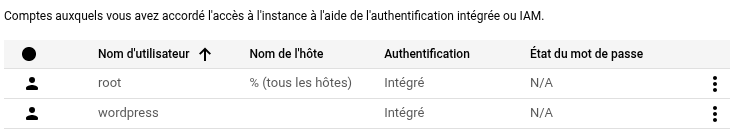
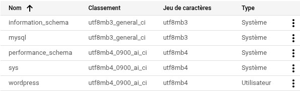
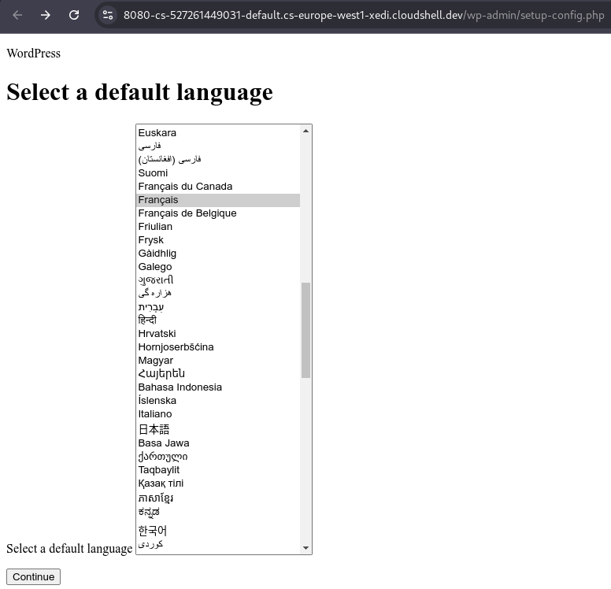
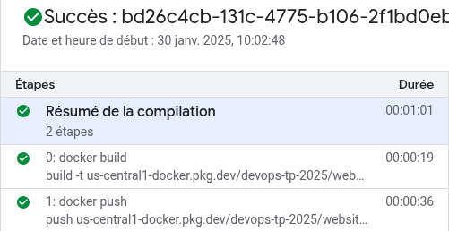
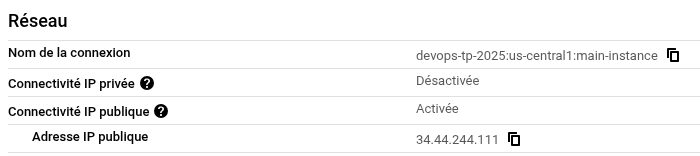
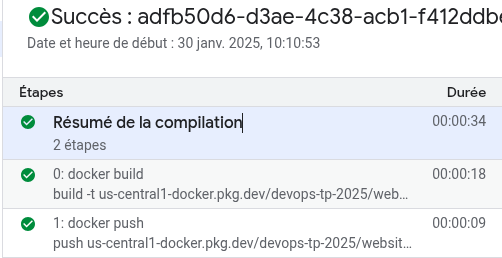
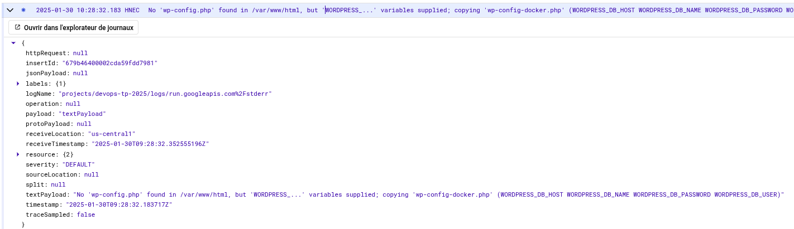
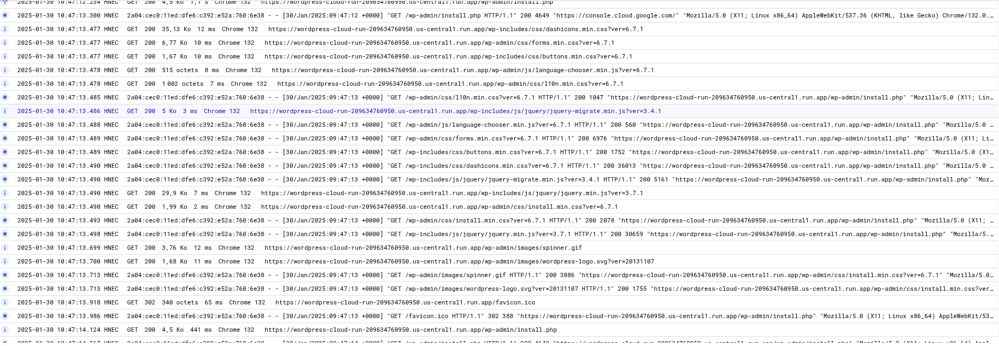
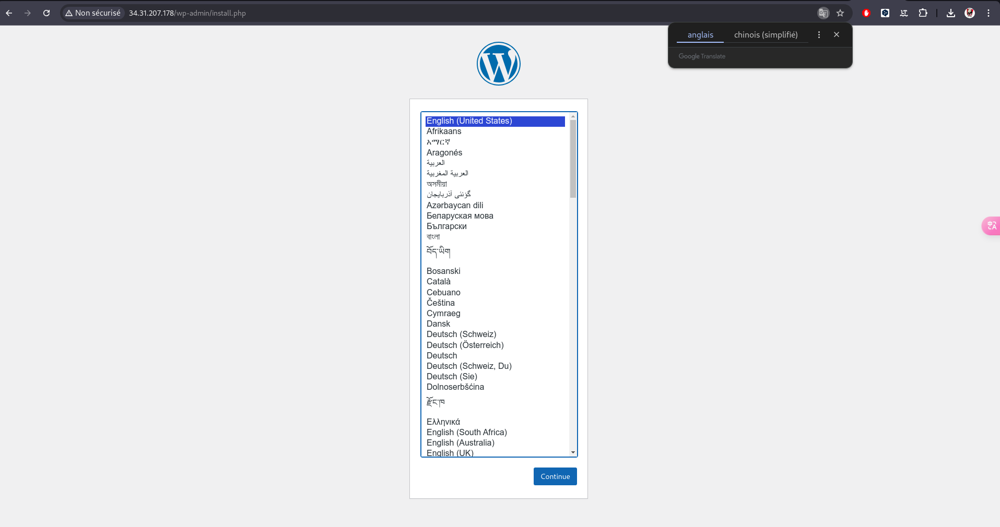
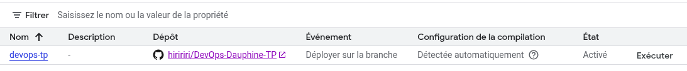

# TP 6


**Saviez vous que [Wordpress](https://wordpress.com/fr/) est le constructeur de site internet le plus utilisé ?**


-> 43% des sites internet ont été réalisés avec WordPress et 63% des blogs 🤯

Vous êtes la nouvelle / le nouveau DevOps Engineer d'une startup 👩‍💻👨‍💻
Vous avez pour objectif de configurer l'infrastructure sur GCP qui hébergera le site de l'entreprise 🌏.

Dans ce TP, l'objectif est de **déployer l'application Wordpress** sur Cloud Run puis Kubernetes en utilisant les outils et pratiques vus ensemble : git, Docker, Artifact Registry, Cloud Build, Infrastructure as Code (Terraform) et GKE.

En bon ingénieur·e DevOps, nous allons découper le travail en  3 parties. Les 2 premières sont complètement indépendantes.

## Partie 1 : Infrastructure as Code

Afin d'avoir une configuration facile à maintenir pour le futur, on souhaite utiliser Terraform pour définir l'infrastructure nécessaire à Wordpress.

**💡 Créez les relations de dépendances entre les ressources pour les créer dans le bon ordre**

Nous allons créer les ressources suivantes à l'aide de Terraform :
- Les APIs nécessaires au bon fonctionnement du projet :
  - `cloudresourcemanager.googleapis.com`
  - `serviceusage.googleapis.com`
  - `artifactregistry.googleapis.com`
  - `sqladmin.googleapis.com`
  - `cloudbuild.googleapis.com`

- Dépôt Artifact Registry avec commme repository_id : `website-tools`

- Une base de données MySQL `wordpress` : l'instance de la base de donnée `main-instance` a été crée pendant le préparation du TP avec la commande `gcloud`

- un compte utilisateur de la base de données

1. Commencer par créer le bucket GCS (Google Cloud Storage) qui servira à stocker le state Terraform.
   ```sh
   PROJECT_ID=$(gcloud config get-value project)
   gsutil mb gs://${PROJECT_ID}-tfstate
   ```
2. Définir les éléments de base nécessaires à la bonne exécution de terraform : utiliser l'exemple sur le [repo du cours](https://github.com/aballiet/devops-dauphine-2024/tree/main/exemple/cloudbuild-terraform) si besoin pour vous aider

   Créer les fichier `main.tf`, `backend.tf` et `terraform.tfvars`.

3. Afin de créer la base de données, utiliser la documentation [SQL Database](https://registry.terraform.io/providers/hashicorp/google/latest/docs/resources/sql_database) et enfin un [SQL User](https://registry.terraform.io/providers/hashicorp/google/latest/docs/resources/sql_user)
   1. Pour `google_sql_database`, définir `name="wordpress"` et `instance="main-instance"`
      ```hcl
      resource "google_sql_database" "database" {
         name     = "wordpress"
         instance = "main-instance"
      }
      ```
   2. Pour `google_sql_user`, définissez le comme ceci :
      ```hcl
      resource "google_sql_user" "wordpress" {
         name     = "wordpress"
         instance = "main-instance"
         password = "ilovedevops"
      }
      ```
4. Lancer `terraform plan`, vérifier les changements puis appliquer les changements avec `terraform apply`

   Output `terraform apply`
   ```sh
   google_sql_database.database: Creating...
   google_project_service.ressource_manager: Creating...
   google_sql_user.wordpress: Creating...
   google_sql_user.wordpress: Creation complete after 1s [id=wordpress//main-instance]
   google_sql_database.database: Creation complete after 2s [id=projects/devops-tp-2025/instances/main-instance/databases/wordpress]
   google_project_service.ressource_manager: Still creating... [10s elapsed]
   google_project_service.ressource_manager: Still creating... [20s elapsed]
   google_project_service.ressource_manager: Creation complete after 23s [id=devops-tp-2025/cloudresourcemanager.googleapis.com]
   google_project_service.cloud_build: Creating...
   google_project_service.artifact: Creating...
   google_project_service.ressource_usage: Creating...
   google_project_service.cloud_build: Creation complete after 4s [id=devops-tp-2025/cloudbuild.googleapis.com]
   google_project_service.artifact: Creation complete after 4s [id=devops-tp-2025/artifactregistry.googleapis.com]
   google_project_service.ressource_usage: Creation complete after 4s [id=devops-tp-2025/serviceusage.googleapis.com]
   Releasing state lock. This may take a few moments...

   Apply complete! Resources: 6 added, 0 changed, 0 destroyed.
   ```

5. Vérifier que notre utilisateur existe bien : https://console.cloud.google.com/sql/instances/main-instance/users (veiller à bien séléctionner le projet GCP sur lequel vous avez déployé vos ressources)

   

6. Rendez-vous sur https://console.cloud.google.com/sql/instances/main-instance/databases. Quelles sont les base de données présentes sur votre instance `main-instance` ? Quels sont les types ?

   Il y en a 4 qui sont de type `Système` créé par défaut, et un `Utilisateur` créé par nous.

   

## Partie 2 : Docker

Wordpress dispose d'une image Docker officielle disponible sur [DockerHub](https://hub.docker.com/_/wordpress)

1. Récupérer l'image sur votre machine (Cloud Shell)

   ```sh
   jiangqinming005@cloudshell:~/DevOps-Dauphine-TP (devops-tp-2025)$ docker pull wordpress
   ```

   ```sh
   jiangqinming005@cloudshell:~/DevOps-Dauphine-TP (devops-tp-2025)$ docker images
   REPOSITORY   TAG       IMAGE ID       CREATED        SIZE
   wordpress    latest    c012b71a41fc   2 months ago   701MB
   ```

2. Lancer l'image docker et ouvrez un shell à l'intérieur de votre container:
   
   ```sh
   jiangqinming005@cloudshell:~/DevOps-Dauphine-TP (devops-tp-2025)$ docker run --name wordpress-container -p 8080:80 -d wordpress
   7ef24fea9d23d296fee65179aec929dc39828bf51bdf57c63f67bd434c41a8d2
   ```

   ```sh
   jiangqinming005@cloudshell:~/DevOps-Dauphine-TP (devops-tp-2025)$ docker ps
   CONTAINER ID   IMAGE       COMMAND                  CREATED              STATUS              PORTS                  NAMES
   7ef24fea9d23   wordpress   "docker-entrypoint.s…"   About a minute ago   Up About a minute   0.0.0.0:8080->80/tcp   wordpress-container
   ```

   1. Quel est le répertoire courant du container (WORKDIR) ?

      ```sh
      jiangqinming005@cloudshell:~/DevOps-Dauphine-TP (devops-tp-2025)$ docker exec -it 7ef24fea9d23 bash
      root@7ef24fea9d23:/var/www/html# 
      ```

   2. Quelles sont les différents fichiers html contenu dans WORKDIR ?

      ```sh
      root@7ef24fea9d23:/var/www/html# ls
      index.php    readme.html      wp-admin            wp-comments-post.php  wp-config-sample.php  wp-cron.php  wp-links-opml.php  wp-login.php  wp-settings.php  wp-trackback.php
      license.txt  wp-activate.php  wp-blog-header.php  wp-config-docker.php  wp-content            wp-includes  wp-load.php        wp-mail.php   wp-signup.php    xmlrpc.php
      ```

3. Supprimez le container puis relancez en un en spécifiant un port binding (une correspondance de port).

   1. Vous devez pouvoir communiquer avec le port par défaut de wordpress : **80** (choisissez un port entre 8000 et 9000 sur votre machine hôte => cloudshell)

      ```sh
      jiangqinming005@cloudshell:~/DevOps-Dauphine-TP (devops-tp-2025)$ docker container stop wordpress-container
      wordpress-container
      jiangqinming005@cloudshell:~/DevOps-Dauphine-TP (devops-tp-2025)$ docker container rm wordpress-container
      wordpress-container
      jiangqinming005@cloudshell:~/DevOps-Dauphine-TP (devops-tp-2025)$ docker ps
      CONTAINER ID   IMAGE     COMMAND   CREATED   STATUS    PORTS     NAMES
      jiangqinming005@cloudshell:~/DevOps-Dauphine-TP (devops-tp-2025)$ docker run --name wordpress-container -p 8080:80 -d wordpress
      88080c35c73bace218f2afe204f12df66a613f1207a153967965f07b2b5795a8
      ```

   2. Avec la commande `curl`, faites une requêtes depuis votre machine hôte à votre container wordpress. Quelle est la réponse ? (il n'y a pas piège, essayez sur un port non utilisé pour constater la différence)

      ```sh
      jiangqinming005@cloudshell:~/DevOps-Dauphine-TP (devops-tp-2025)$ curl http://localhost:8080
      jiangqinming005@cloudshell:~/DevOps-Dauphine-TP (devops-tp-2025)$ curl http://localhost:8081
      curl: (7) Failed to connect to localhost port 8081 after 0 ms: Couldn't connect to server
      ```

      Il n'y a rien qui a affiché quand appel sur le port `8080` binding, mais une erreur sur le port `8081` non binding.

   3. Afficher les logs de votre container après avoir fait quelques requêtes, que voyez vous ?

      ```sh
      jiangqinming005@cloudshell:~/DevOps-Dauphine-TP (devops-tp-2025)$ docker logs wordpress-container
      WordPress not found in /var/www/html - copying now...
      Complete! WordPress has been successfully copied to /var/www/html
      AH00558: apache2: Could not reliably determine the server's fully qualified domain name, using 172.17.0.2. Set the 'ServerName' directive globally to suppress this message
      AH00558: apache2: Could not reliably determine the server's fully qualified domain name, using 172.17.0.2. Set the 'ServerName' directive globally to suppress this message
      [Thu Jan 30 08:18:41.169741 2025] [mpm_prefork:notice] [pid 1:tid 1] AH00163: Apache/2.4.62 (Debian) PHP/8.2.27 configured -- resuming normal operations
      [Thu Jan 30 08:18:41.169816 2025] [core:notice] [pid 1:tid 1] AH00094: Command line: 'apache2 -D FOREGROUND'
      172.17.0.1 - - [30/Jan/2025:08:19:46 +0000] "GET / HTTP/1.1" 302 235 "-" "curl/8.5.0"
      172.17.0.1 - - [30/Jan/2025:08:22:32 +0000] "GET / HTTP/1.1" 302 235 "-" "curl/8.5.0"
      172.17.0.1 - - [30/Jan/2025:08:22:34 +0000] "GET / HTTP/1.1" 302 235 "-" "curl/8.5.0"
      ```

      On peut constater les appels de notre, ici on en a fait 3.

   4. Utilisez l'aperçu web pour afficher le résultat du navigateur qui se connecte à votre container wordpress
      1. Utiliser la fonction `Aperçu sur le web`
        
      2. Modifier le port si celui choisi n'est pas `8000`
      3. Une fenètre s'ouvre, que voyez vous ?

         

         On voit l'accès web de wordpress runing dans le container.

4. A partir de la documentation, remarquez les paramètres requis pour la configuration de la base de données.

   ```sh
   -e WORDPRESS_DB_HOST=...
   -e WORDPRESS_DB_USER=...
   -e WORDPRESS_DB_PASSWORD=...
   -e WORDPRESS_DB_NAME=...
   -e WORDPRESS_TABLE_PREFIX=...
   ```

5. Dans la partie 1 du TP (si pas déjà fait), nous allons créer cette base de donnée. Dans cette partie 2 nous allons créer une image docker qui utilise des valeurs spécifiques de paramètres pour la base de données.
   1. Créer un Dockerfile
   2. Spécifier les valeurs suivantes pour la base de données à l'aide de l'instruction `ENV` (voir [ici](https://stackoverflow.com/questions/57454581/define-environment-variable-in-dockerfile-or-docker-compose)):
        - `WORDPRESS_DB_USER=wordpress`
        - `WORDPRESS_DB_PASSWORD=ilovedevops`
        - `WORDPRESS_DB_NAME=wordpress`
        - `WORDPRESS_DB_HOST=0.0.0.0`
   3. Construire l'image docker.

      ```sh
      jiangqinming005@cloudshell:~/DevOps-Dauphine-TP (devops-tp-2025)$ docker build -t image-wordpress:0.1 .
      [+] Building 0.4s (5/5) FINISHED                                                                                                                                                                                       docker:default
      => [internal] load build definition from Dockerfile                                                                                                                                                                             0.0s
      => => transferring dockerfile: 186B                                                                                                                                                                                             0.0s
      => WARN: SecretsUsedInArgOrEnv: Do not use ARG or ENV instructions for sensitive data (ENV "WORDPRESS_DB_PASSWORD") (line 5)                                                                                                    0.0s
      => [internal] load metadata for docker.io/library/wordpress:latest                                                                                                                                                              0.0s
      => [internal] load .dockerignore                                                                                                                                                                                                0.0s
      => => transferring context: 2B                                                                                                                                                                                                  0.0s
      => [1/1] FROM docker.io/library/wordpress:latest                                                                                                                                                                                0.3s
      => exporting to image                                                                                                                                                                                                           0.0s
      => => exporting layers                                                                                                                                                                                                          0.0s
      => => writing image sha256:4c6ec37f97d2e843d7a3a3ad3a5a1edbd706f44d6b39f43888dcf6ea20fda854                                                                                                                                     0.0s
      => => naming to docker.io/library/image-wordpress:0.1                                                                                                                                                                           0.0s

      1 warning found (use docker --debug to expand):
      - SecretsUsedInArgOrEnv: Do not use ARG or ENV instructions for sensitive data (ENV "WORDPRESS_DB_PASSWORD") (line 5)
      ```

   4. Lancer une instance de l'image, ouvrez un shell. Vérifier le résultat de la commande `echo $WORDPRESS_DB_PASSWORD`

      ```sh
      jiangqinming005@cloudshell:~/DevOps-Dauphine-TP (devops-tp-2025)$ docker run -it --name wordpress-container -d image-wordpress:0.1 /bin/bash
      fa5216b3de97c55b1ed280b3c382c70dcca1c01e35e4adeb330dc397acc3e623
      jiangqinming005@cloudshell:~/DevOps-Dauphine-TP (devops-tp-2025)$ docker ps
      CONTAINER ID   IMAGE                 COMMAND                  CREATED         STATUS         PORTS     NAMES
      fa5216b3de97   image-wordpress:0.1   "docker-entrypoint.s…"   9 seconds ago   Up 9 seconds   80/tcp    wordpress-container
      jiangqinming005@cloudshell:~/DevOps-Dauphine-TP (devops-tp-2025)$ docker exec -it wordpress-container bash
      root@fa5216b3de97:/var/www/html# echo $WORDPRESS_DB_PASSWORD
      ilovedevops
      ```

6. Pipeline d'Intégration Continue (CI):
   1. Créer un dépôt de type `DOCKER` sur artifact registry (si pas déjà fait, sinon utiliser celui appelé `website-tools`)

      

   2. Créer une configuration cloudbuild pour construire l'image docker et la publier sur le depôt Artifact Registry

      ```yaml
      options:
         logging: CLOUD_LOGGING_ONLY      

      substitutions:
         _LOCATION: 'us-central1'
         _REGION: 'us-central1'
         _ARTIFACT_REPO_NAME: 'website-tools'
         _VERSION: '0.1'
         _IMAGE_NAME: 'image-wordpress'

      steps:
      - id: 'docker build'
      name: 'gcr.io/cloud-builders/docker'
      args:
         - 'build'
         - '-t'
         - '${_REGION}-docker.pkg.dev/$PROJECT_ID/${_ARTIFACT_REPO_NAME}/${_IMAGE_NAME}:${_VERSION}'
         - '.'

      - id: 'docker push'
      name: 'gcr.io/cloud-builders/docker'
      args:
         - 'push'
         - '${_REGION}-docker.pkg.dev/$PROJECT_ID/${_ARTIFACT_REPO_NAME}/${_IMAGE_NAME}:${_VERSION}'
      ```

   3. Envoyer (`submit`) le job sur Cloud Build et vérifier que l'image a bien été créée

      ```sh
      jiangqinming005@cloudshell:~/DevOps-Dauphine-TP (devops-tp-2025)$ gcloud builds submit --config cloudbuild.yaml 
      Creating temporary archive of 19 file(s) totalling 897.6 KiB before compression.
      Some files were not included in the source upload.

      Check the gcloud log [/tmp/tmp.NcCKCxaMut/logs/2025.01.30/09.02.45.398196.log] to see which files and the contents of the
      default gcloudignore file used (see `$ gcloud topic gcloudignore` to learn
      more).

      Uploading tarball of [.] to [gs://devops-tp-2025_cloudbuild/source/1738227765.661043-4ee85742b4434fb9b54ab4b5db305cd3.tgz]
      Created [https://cloudbuild.googleapis.com/v1/projects/devops-tp-2025/locations/global/builds/bd26c4cb-131c-4775-b106-2f1bd0ebe06b].
      Logs are available at [ https://console.cloud.google.com/cloud-build/builds/bd26c4cb-131c-4775-b106-2f1bd0ebe06b?project=209634760950 ].

      gcloud builds submit only displays logs from Cloud Storage. To view logs from Cloud Logging, run:
      gcloud beta builds submit

      Waiting for build to complete. Polling interval: 1 second(s).
      ID: bd26c4cb-131c-4775-b106-2f1bd0ebe06b
      CREATE_TIME: 2025-01-30T09:02:47+00:00
      DURATION: 1M2S
      SOURCE: gs://devops-tp-2025_cloudbuild/source/1738227765.661043-4ee85742b4434fb9b54ab4b5db305cd3.tgz
      IMAGES: -
      STATUS: SUCCESS
      ```

      

## Partie 3 : Déployer Wordpress sur Cloud Run puis Kubernetes 🔥

Nous allons maintenant mettre les 2 parties précédentes ensemble.

Notre but, ne l'oublions pas est de déployer wordpress sur Cloud Run puis Kubernetes !

### Configurer l'adresse IP de la base MySQL utilisée par Wordpress

1. Rendez vous sur : https://console.cloud.google.com/sql/instances/main-instance/connections/summary?
   L'instance de base données dispose d'une `Adresse IP publique`. Nous allons nous servir de cette valeur pour configurer notre image docker Wordpress qui s'y connectera.

   

2. Reprendre le Dockerfile de la [Partie 2](#partie-2--docker) et le modifier pour que `WORDPRESS_DB_HOST` soit défini avec l'`Adresse IP publique` de notre instance de base de donnée.

   ```sh
   FROM wordpress

   ENV WORDPRESS_DB_HOST=34.44.244.111
   ENV WORDPRESS_DB_USER=wordpress
   ENV WORDPRESS_DB_PASSWORD=ilovedevops
   ENV WORDPRESS_DB_NAME=wordpress
   ```

3. Reconstruire notre image docker et la pousser sur notre Artifact Registry en utilisant cloud build

   

### Déployer notre image docker sur Cloud Run

1. Ajouter une ressource Cloud Run à votre code Terraform. Veiller à renseigner le bon tag de l'image docker que l'on vient de publier sur notre dépôt dans le champs `image` ainsi que le port utilisé par notre application.

   Afin d'autoriser tous les appareils à se connecter à notre Cloud Run, on définit les ressources :

   ```hcl
   data "google_iam_policy" "noauth" {
      binding {
         role = "roles/run.invoker"
         members = [
            "allUsers",
         ]
      }
   }

   resource "google_cloud_run_service_iam_policy" "noauth" {
      location    = google_cloud_run_service.default.location # remplacer par le nom de votre ressource
      project     = google_cloud_run_service.default.project # remplacer par le nom de votre ressource
      service     = google_cloud_run_service.default.name # remplacer par le nom de votre ressource

      policy_data = data.google_iam_policy.noauth.policy_data
   }
   ```

   ☝️ Vous aurez besoin d'activer l'API : `run.googleapis.com` pour créer la ressource de type `google_cloud_run_service`. Faites en sorte que l'API soit activé avant de créer votre instance Cloud Run 😌

   Appliquer les changements sur votre projet gcp avec les commandes terraform puis rendez vous sur https://console.cloud.google.com/run pendant le déploiement.

2. Observer les journaux de Cloud Run (logs) sur : https://console.cloud.google.com/run/detail/us-central1/serveur-wordpress/logs.
   1. Véirifer la présence de l'entrée `No 'wp-config.php' found in /var/www/html, but 'WORDPRESS_...' variables supplied; copying 'wp-config-docker.php' (WORDPRESS_DB_HOST WORDPRESS_DB_PASSWORD WORDPRESS_DB_USER)`

      

   2. Au bout de 5 min, que se passe-t-il ? 🤯🤯🤯

      Au bout de 5 minutes, la création de cloud run échoue.

   3. Regarder le resultat de votre commande `terraform apply` et observer les logs de Cloud Run

      ```sh
      google_cloud_run_service_iam_policy.noauth: Creating...
      google_cloud_run_service_iam_policy.noauth: Creation complete after 1s [id=v1/projects/devops-tp-2025/locations/us-central1/services/wordpress-cloud-run]
      Releasing state lock. This may take a few moments...

      Apply complete! Resources: 1 added, 0 changed, 0 destroyed.
      ```

3. Autoriser toutes les adresses IP à se connecter à notre base MySQL (sous réserve d'avoir l'utilisateur et le mot de passe évidemment)
   1. Pour le faire, exécuter la commande
      ```bash
      gcloud sql instances patch main-instance \
      --authorized-networks=0.0.0.0/0
      ```

5. Accéder à notre Wordpress déployé 🚀
   1. Aller sur : https://console.cloud.google.com/run/detail/us-central1/serveur-wordpress/metrics?
   2. Cliquer sur l'URL de votre Cloud Run : similaire à https://serveur-wordpress-oreldffftq-uc.a.run.app
   3. Que voyez vous ? 🙈

      On arrive à avoir l'accès sur le page web de wordpress run dans le containeur.

      

      On peut aussi voir des logs normals dans l'onglet `Journaux` de Cloud Run.

      

6. Afin d'avoir un déploiement plus robuste pour l'entreprise et économiser les coûts du service CloudSQL, nous allons déployer Wordpress sur Kubernetes
   1. Rajouter le provider kubernetes en dépendance dans `required_providers`
   2. Configure le provider kubernetes pour se connecter à notre cluster GKE

      ```hcl
      data "google_client_config" "default" {}

      data "google_container_cluster" "my_cluster" {
         name     = "gke-dauphine"
         location = "us-central1-a"
      }

      provider "kubernetes" {
         host                   = data.google_container_cluster.my_cluster.endpoint
         token                  = data.google_client_config.default.access_token
         cluster_ca_certificate = base64decode(data.google_container_cluster.my_cluster.master_auth.0.cluster_ca_certificate)
      }
      ```

   3. Déployer wordpress ainsi qu'une base de donnée MySQL sur le cluster GKE, vous pouvez vous aider de ChatGPT ou de la documentation officielle. Exemple de prompt: 
   ```
   Give me the terraform code to deploy wordpress on kubernetes using kubernetes provider. I want to use MySQL.
   ```

   4. Rendez vous sur l'adresse IP publique du service kubernetes Wordpress et vérifiez que Wordpress fonctionne 🔥

      `34.31.207.178`

      

## BONUS : Partie 4

1. Utiliser Cloud Build pour appliquer les changements d'infrastructure

   

2. Quelles critiques du TP pouvez vous faire ? Quels sont les éléments redondants de notre configuration ?
   1. Quels paramètres avons nous dû recopier plusieurs fois ? Comment pourrions nous faire pour ne pas avoir à les recopier ?

      Configuration des variables de la base de données (WORDPRESS_DB_HOST, WORDPRESS_DB_USER, WORDPRESS_DB_PASSWORD).
      Configuration du provider Kubernetes (host, token, cluster_ca_certificate).
      Définitions des services Cloud SQL, Artifact Registry, Cloud Run et Kubernetes qui pourraient être générées dynamiquement.
      Amélioration possible est d'utiliser des variables Terraform (variables.tf) pour éviter la répétition des mêmes valeurs.

   2. Quel outil pouvons nous utiliser pour déployer Wordpress sur Kubernetes ? Faites les changements nécessaires dans votre code Terraform.

   Utiliser Helm dans Terraform.

   3. Comment pourrions nous enlever le mot de passe en clair dans notre code Terraform ? Quelle ressource Kubernetes pouvons nous utiliser pour le stocker ? Faites les changements nécessaires dans votre code Terraform.

   Créer un fichier `varabiles.tf` et ajouter dans `terraform.tfvars`.
   
   Par exemple : 

   ```
   project="devops-tp-2025"
   region="us-central1"
   service_name="wordpress-cloud-run"
   artifact_repo_name="website-tools"
   ```
